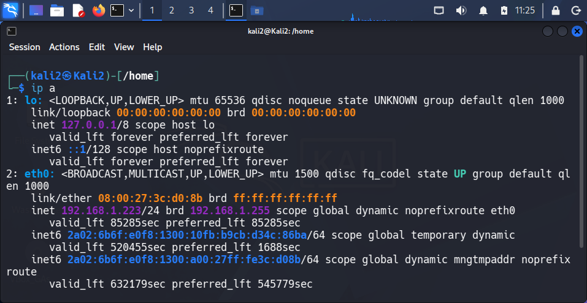
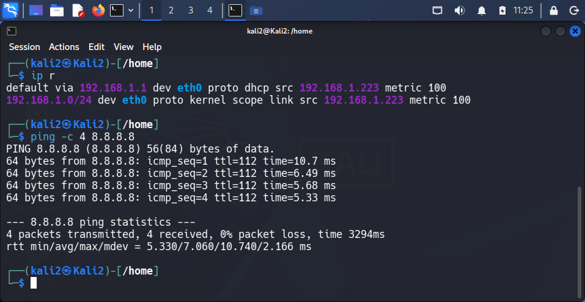
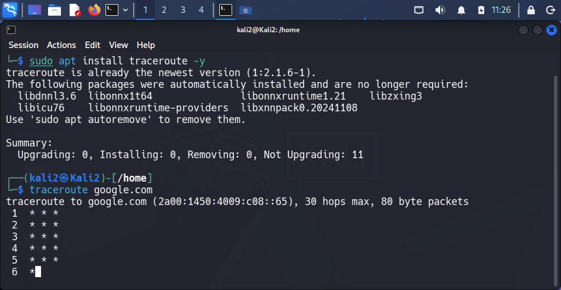
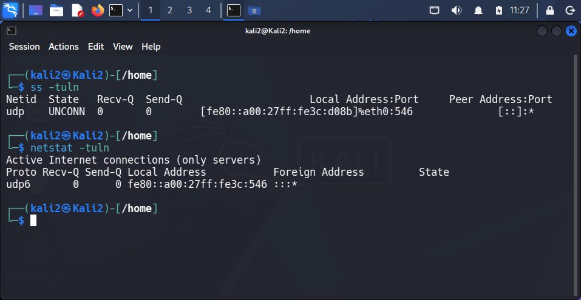
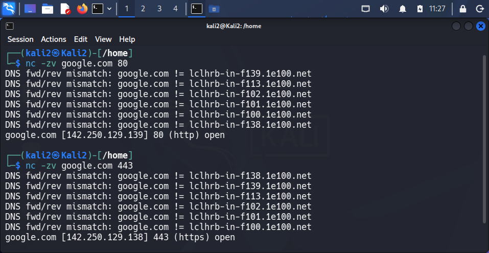
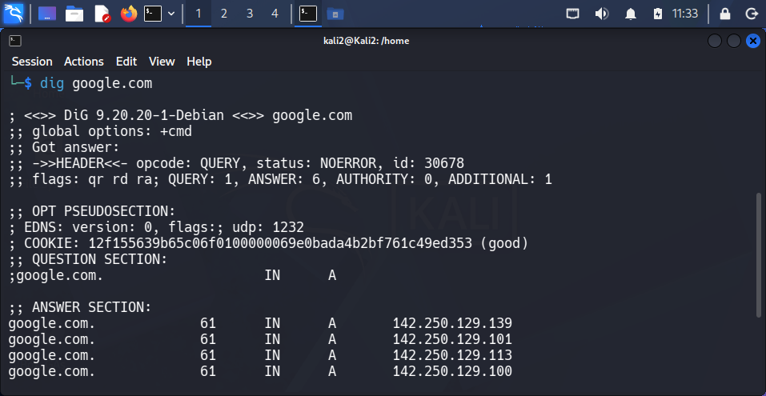

# Работа с базовыми сетевыми утилитами

---

## 1. Утилита ip

### Команды:
ip a  
ip r  

### Пояснение:
Команда ip используется для просмотра сетевых интерфейсов и маршрутов.

### Результат:
- ip a показывает все сетевые интерфейсы и их IP-адреса  
- ip r показывает таблицу маршрутизации (куда отправляется трафик)

Это позволяет понять:
- есть ли IP у машины  
- есть ли доступ в сеть  
- куда идут пакеты  

Рисунок 1. Конфигурация сетевых интерфейсов и маршрутов.

---

## 2. Утилита ping

### Команды:
ping -c 4 8.8.8.8  
ping -c 4 google.com  

### Пояснение:
Команда ping проверяет доступность удалённого узла.

### Результат:
- если пингуется 8.8.8.8 → интернет работает  
- если пингуется google.com → работает DNS  

Рисунок 2. Проверка соединения с IP-адресом и доменным именем.

---

## 3. Утилита traceroute

### Команда:
traceroute google.com  

### Пояснение:
Команда показывает путь, по которому пакеты идут до цели.

### Результат:
Каждая строка — это один промежуточный узел (роутер).

Рисунок 3. Маршрут до удалённого сервера.

---

## 4. Утилита ss / netstat

### Команда:
ss -tuln  

### Пояснение:
Команда показывает:
- открытые порты  
- активные соединения  

### Результат:
Можно определить:
- какие сервисы запущены  
- какие порты слушают подключения  

Рисунок 4. Открытые порты и активные соединения.

---

## 5. Утилита netcat

### Команды:
nc -zv google.com 80  
nc -zv google.com 443  

### Пояснение:
Netcat используется для проверки доступности портов.

### Результат:
Если соединение успешно:
- порт открыт  
- сервис доступен  

Рисунок 5. Проверка доступности портов.

---

## 6. Утилита dig

### Команды:
dig google.com  
dig google.com +short  

### Пояснение:
Команда dig используется для работы с DNS.

### Результат:
Показывает IP-адрес, связанный с доменным именем.

Рисунок 6. Результат DNS-запроса.

---

