#Task 2   Сеть, SSH, NAT и Port Forwarding

## Цель работы
В этой работе я настроил небольшую сеть из трёх машин: Kali Linux (основная машина), Debian1 (роутер/посредник) и Debian2 (внутренний сервер). Основные задачи: настроить сеть между машинами, дать Debian2 доступ в интернет через Debian1, настроить SSH подключения, установить веб-сервер и сделать доступ к нему через port forwarding.

## Схема сети
Debian1 имеет два сетевых интерфейса: 192.168.50.2 (сеть с Kali) и 192.168.60.1 (сеть с Debian2). Debian2 находится в сети 192.168.60.0/24 и имеет адрес 192.168.60.2.

## Настройка DNS
На Debian1 был настроен DNS сервер 8.8.8.8 (файл /etc/resolv.conf).
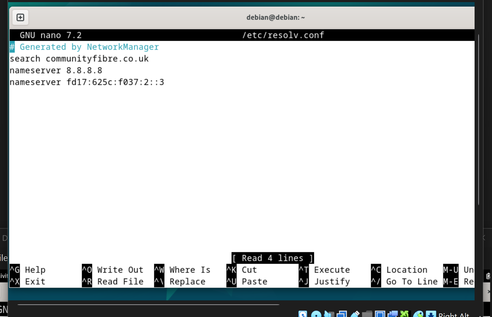

На Debian2 был настроен DNS сервер 1.1.1.1.
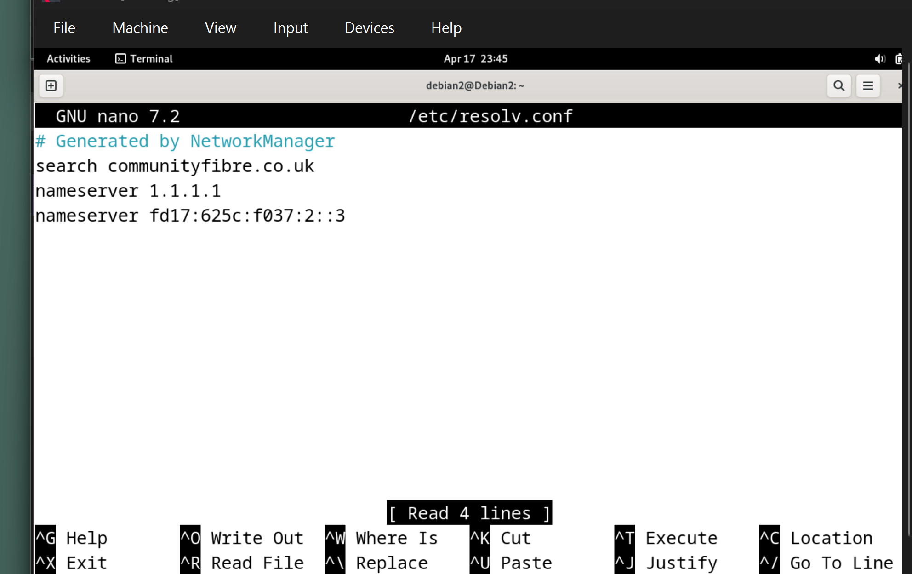

## Проверка интернета
На Debian2 была выполнена команда ping google.com.
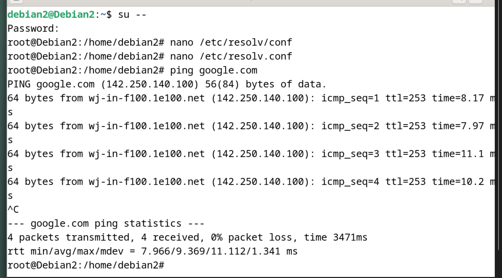

## SSH подключения
С Kali выполнено подключение к Debian1.
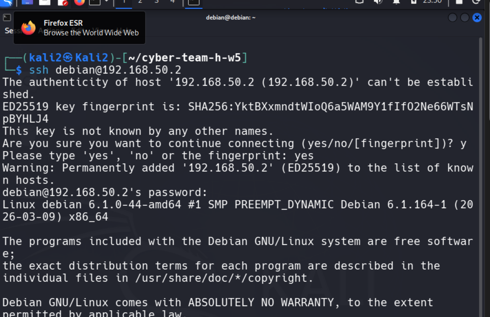

Далее с Debian1 выполнено подключение к Debian2.
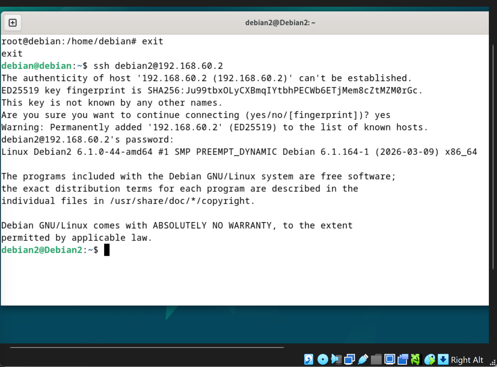

## Подключение через Jump Host
Был настроен файл ~/.ssh/config, чтобы подключаться к Debian2 через Debian1 (jump host).
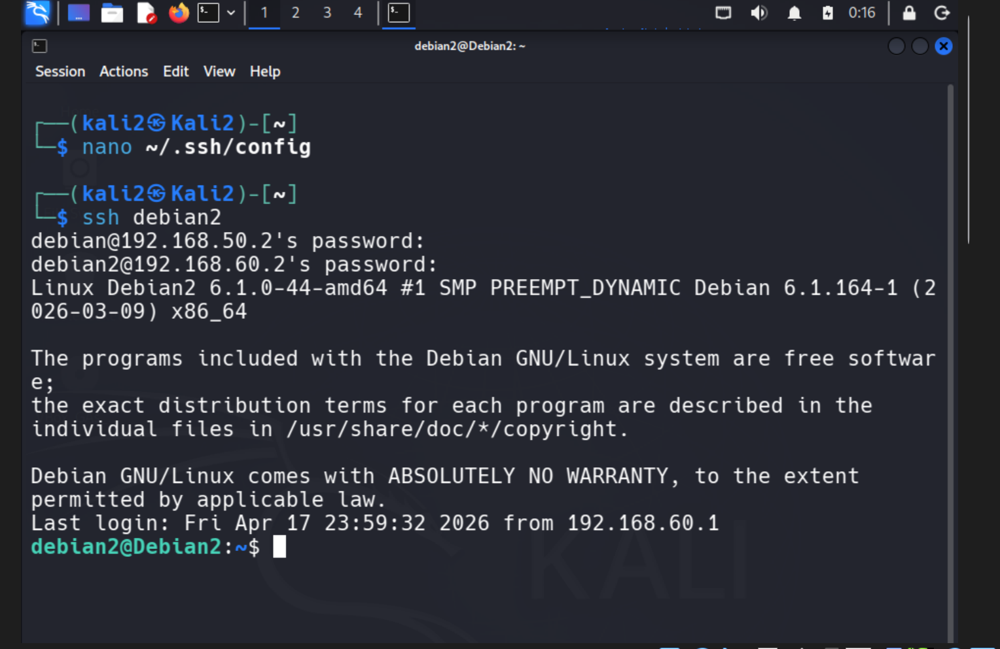

Теперь можно подключаться напрямую командой ssh debian2.

## Установка веб-сервера
На Debian2 был установлен nginx.
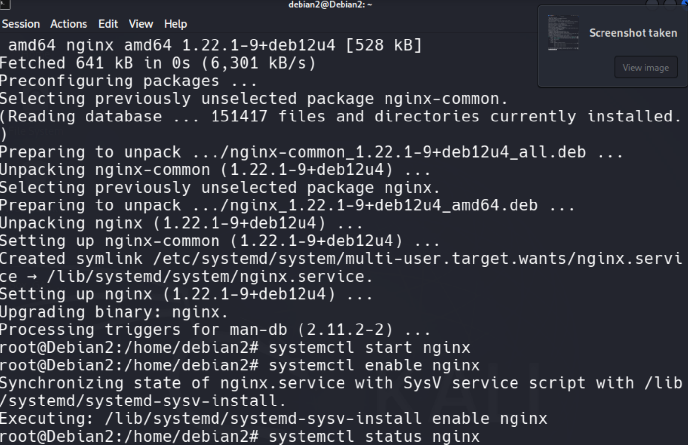

Проверка статуса:
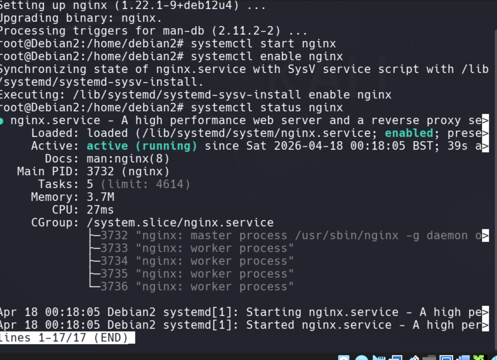

Сервис запущен и работает.

## Проверка локально
На Debian2 выполнена команда curl localhost.
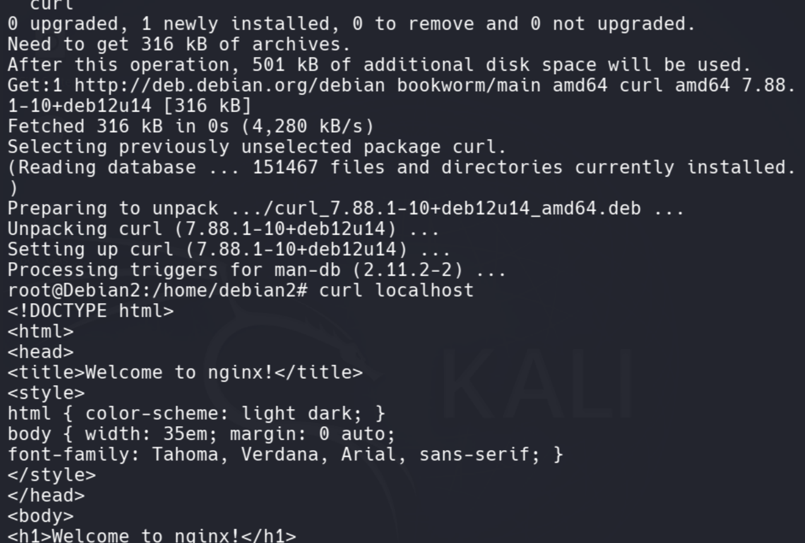

Была получена HTML страница nginx

## Настройка Port Forwarding (DNAT)
На Debian1 было настроено правило iptables:
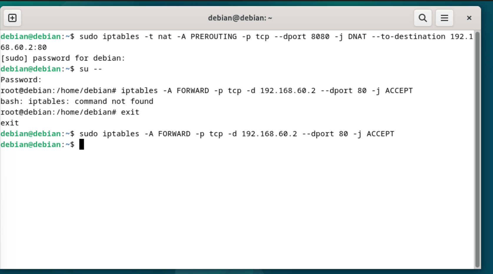

С Kali выполнена команда curl 192.168.50.2:8080.
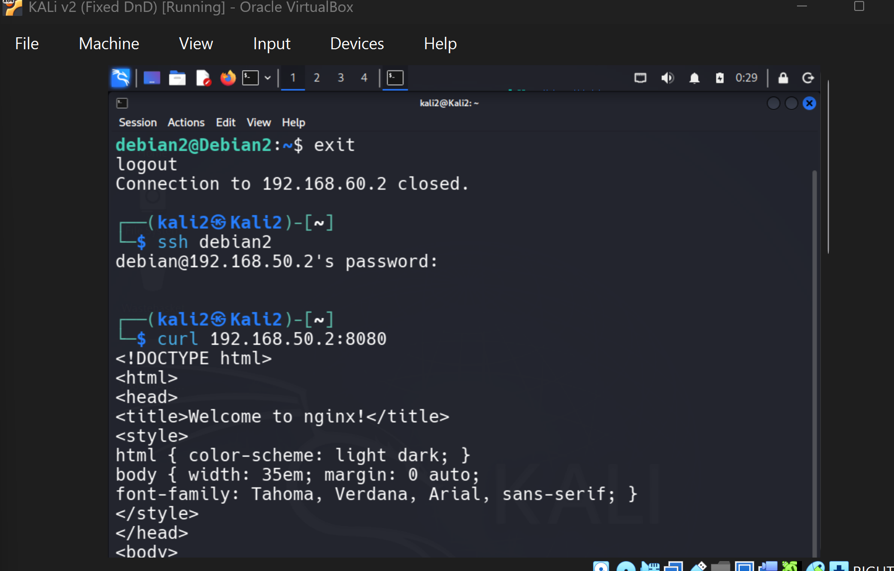

